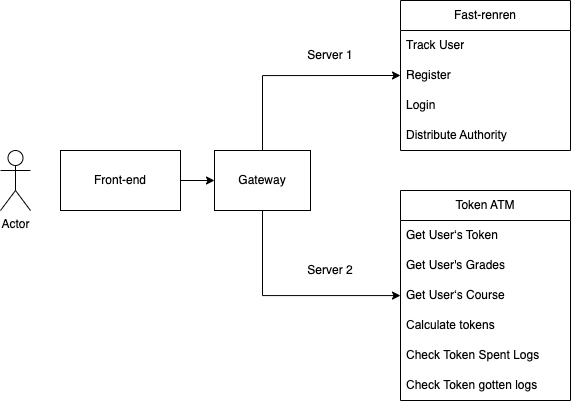

## Token ATM front project front end


- This is a capstone project for UCI MSWE program. The project is designed to help TAs and professors better manage the token and for students to better use the token.
- The system is developed separately between the front-end and back-end.

### Structure


Pre-steps for the backend:
1. run the mysql
   ```
   mysql.server start
   ```
2. run the fastrenren backend server
3. run the token ATM backend server
4. run the gateway server
5. open the [nacos](https://github.com/alibaba/nacos) website and check 3 servers 
   

### Environment setup
- The front-end is developed base on the open-source project [renren-fast-vue](https://github.com/renrenio/renren-fast-vue), renren-fast-vue has its back-end [renren-fast](https://gitee.com/renrenio/renren-fast), and it has been integrated into our back-end project as a module.
#### Set Up Steps：
1. To start the front-end, the back-end should be started first, you have to have mysql(>=5.6) installed and change the db name, username and password in the application-dev.yml in back-end project. After the back-end service started, make sure have node installed(>=10) and then go to the work directory of renren-fast-vue run the following commands:
  ```shell
    brew install nvm 
    nvm install 10  
    cd renren-fast-vue
    npm install
  ```
2. change the base url to the port of "Gateway" in the ''' static/config/index.js'''
   
   ```
    window.SITE_CONFIG['baseUrl'] = 'http://localhost:YOUR_GATEWAY_PORT/api';
   ```
3. run the project, make sure you see the captcha on the home page
   ```
    npm run dev
   ```

